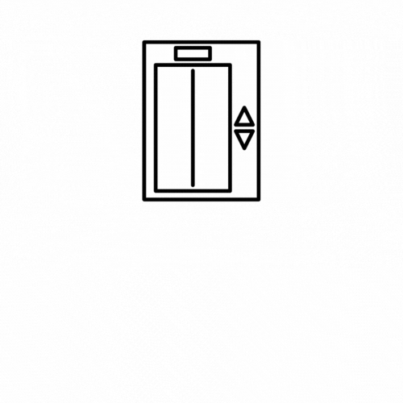

# LiftSim: Simulating Elevator Efficiency

    

## 1. Introduction
LiftSim is a data science project aimed at improving elevator efficiency and reducing wait times in multi-floor 
buildings, particularly, S16 building at the National University of Singapore (NUS). By utilizing statistical modeling 
techniques and simulation software, LiftSim provides valuable insights into elevator performance and management. 

Our goal is to revolutionize the way elevators are managed, and provide building managers with the tools and insights 
needed to optimize their elevator operations. With LiftSim, building managers can effortlessly simulate different 
elevator management strategies, and analyze the impact of those strategies on elevator throughput and wait times. 
By empowering data-driven decisions, LiftSim helps building managers to maximize efficiency, reduce wait times, and 
improve the overall experience for elevator users.

<em>Project Team: AY22/23 DSA3101 Group 07-S16</em>

<strong>

Front-end authors:
[Xiangyu Zhang](https://github.com/Oliverzhang0314),
[Yating Tang](https://github.com/TY789),
[Zixuan Wang](https://github.com/Wang-Zixuann) and
[Yuxin Li](https://github.com/xxEthene)

Back-end authors:
[Dorothy Boyle](https://github.com/pintubread),
[Jerome Neo](https://github.com/jerome-neo),
[Kevin Christian](https://github.com/kevinchs0808) and
[Steven Seah](https://github.com/stevvseah)

</strong>

## 2. Installation
This application is meant to be served on Docker.

## 3. Usage
For more information regarding the simulation model, please see our [Back End User Guide](docs/UserGuide.md).

For more information regarding using the web app, please see our [Front End User Guide](docs/FrontendUserGuide.md).

## 4. Data
Data collection was done between February and March 2023. The data was collected at NUS S16 building elevators.
There are a total of 3 lifts in the S16 building.

## 5. Results

## 6. Contributing

## 7. License

## 8. Acknowledgments

## 9. References
Simpy documentation.

