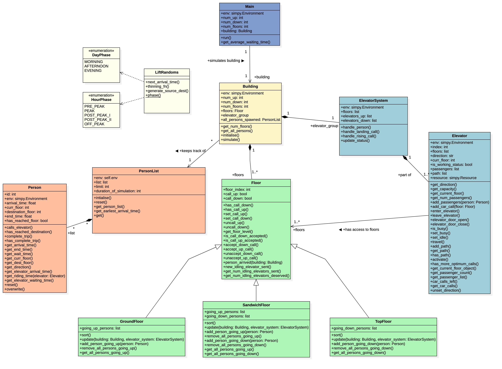

- Table of Contents
  {:toc}

---

## **Acknowledgements**

- {list here sources of all reused/adapted ideas, code, documentation, and third-party libraries -- include links to the original source as well}

---

## **Design**

:bulb: **Tip:** The `.mdj` files used to create diagrams in this document can be found in the [diagrams](diagrams) 
folder. 

### Architecture Diagrams
The **_Architecture Diagram_** given shows the high-level implementation of our Flask application.

### Class Diagrams

The **_Class Diagram_** given above explains the associations between classes in our source files.

